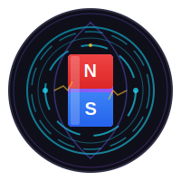
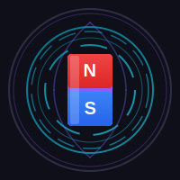

# Eddy Current Explorer - Logos

This folder contains logos for the Eddy Current Explorer interactive physics app.

## Logo Files

| File | Description | Use Case |
|------|-------------|----------|
| `logo.svg` | Animated logo with rotating eddy currents and glowing effects | Main app logo, splash screen |
| `logo-static.svg` | Static version without animations | Social media, print materials |
| `favicon.svg` | Small 32x32 icon | Browser tab icon, favicon |
| `logo-icon-only.svg` | Icon without text | App launcher, small icons |

## Design Elements

The logo represents:
- **Central Magnet** (N/S poles) - The source of magnetic field
- **Swirling Rings** - Eddy currents induced in the conductor
- **Purple/Blue Gradient** - Physics/electromagnetism theme
- **Cyan Rings** - The electric currents flowing

## Colors

- **Primary Purple**: `#6366f1` - Main brand color
- **North Pole Red**: `#ef4444` - Magnet north
- **South Pole Blue**: `#3b82f6` - Magnet south
- **Current Cyan**: `#06b6d4` - Eddy current rings
- **Background Dark**: `#0f0f1a` - Dark theme

## Usage in HTML

```html
<!-- Main Logo -->


<!-- Favicon -->
<link rel="icon" type="image/svg+xml" href="favicon.svg">

<!-- Static for PDF/Print -->

```

## Converting to PNG (if needed)

To use these in places that don't support SVG, convert them:

1. **Online**: Use [SVG to PNG](https://svgtopng.com/)
2. **Command Line** (if you have ImageMagick):
   ```bash
   convert -background none logo.svg logo.png
   ```
3. **Design Software**: Open in Figma, Adobe Illustrator, etc. and export

## Credits

Created for Science Unpacked - Eddy Current Explorer
Physics Education Project 2026
